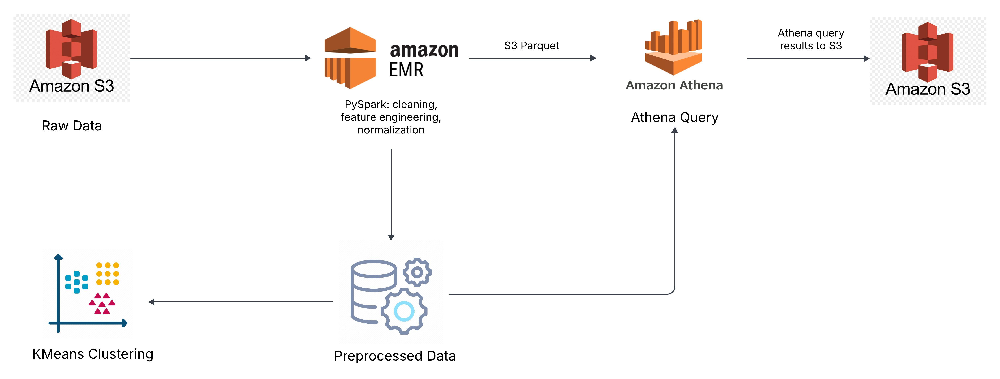
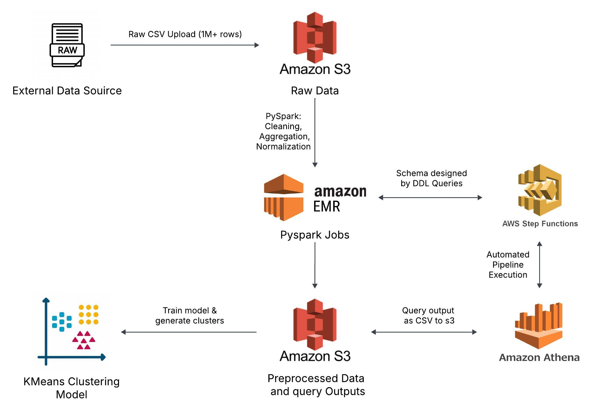
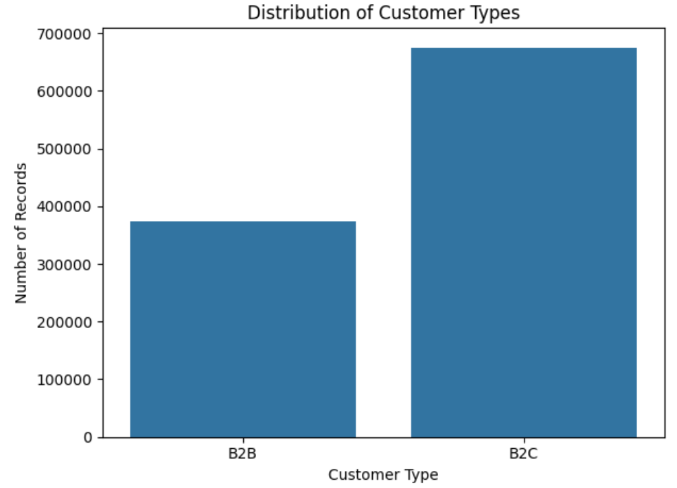
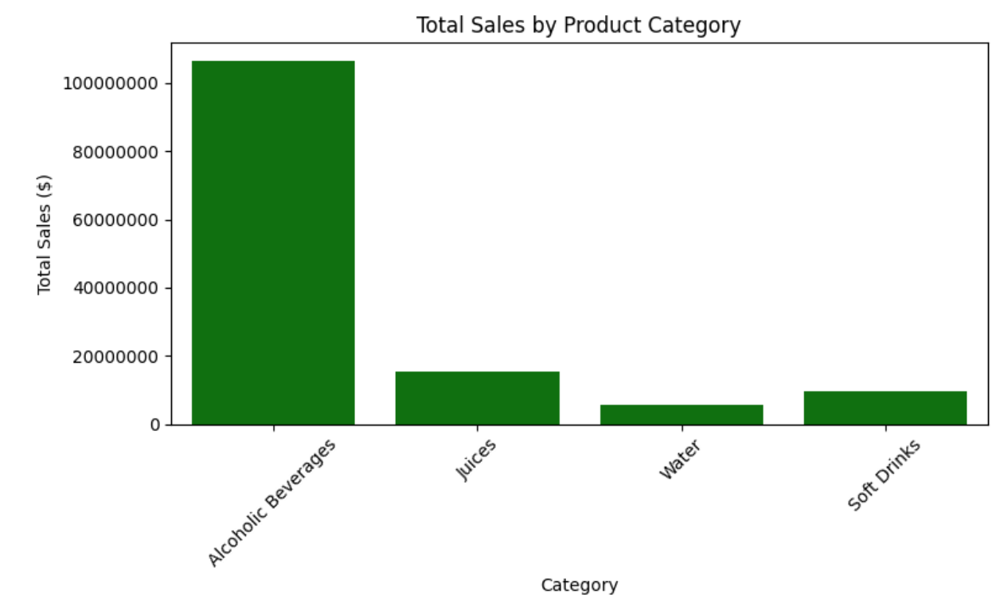
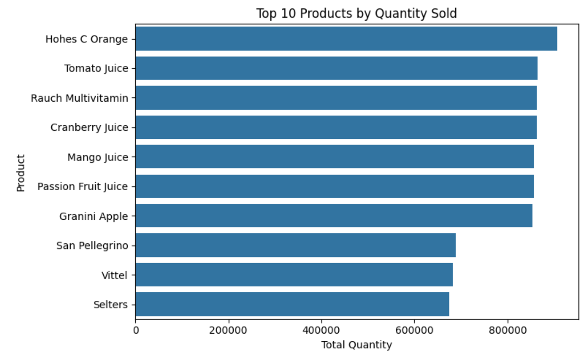
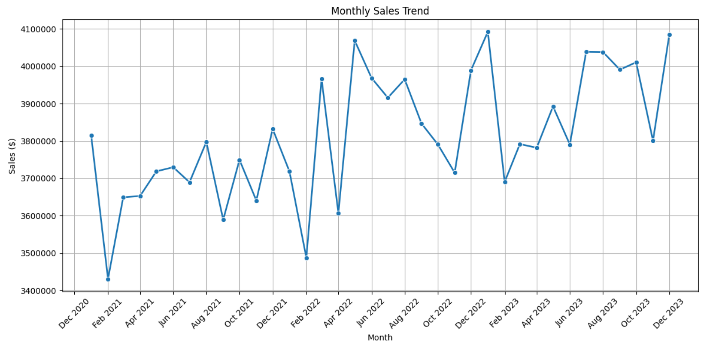
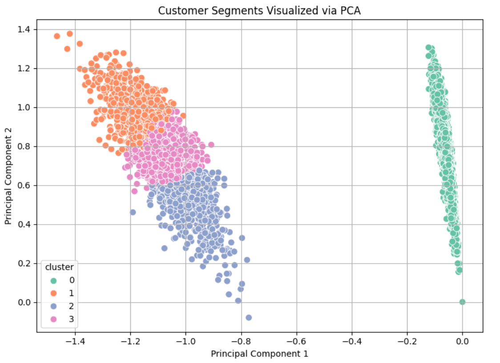

# 📊 Sales Analysis Models Using PySpark on AWS

End-to-end sales analytics pipeline leveraging **PySpark on AWS** to handle large-scale beverage sales data (1M+ rows). This project covers scalable data preprocessing, storage, and orchestration on AWS EMR, S3, and Athena, and performs **customer segmentation using KMeans clustering with PCA** for dimensionality reduction.

---

## 🚀 Project Highlights

- ✅ Scalable pipeline built using **AWS EMR, S3, Athena, and Step Functions**
- ✅ Ingested and processed **1M+ beverage sales records**
- ✅ Applied **KMeans clustering** to segment customers based on purchasing behavior
- ✅ Reduced dimensions via **PCA** for better cluster interpretability
- ✅ Visualized and exported results for further business analysis

---

## 🧰 Tech Stack

- **Languages & Frameworks:** Python, PySpark, Pandas, Scikit-learn, Matplotlib, Seaborn, MLib
- **AWS Services:** S3, EMR, Athena
- **Tools:** Jupyter Notebook, AWS CLI

---

## 🧠 Machine Learning Overview

- **Unsupervised Learning:** KMeans Clustering  
- **Dimensionality Reduction:** PCA (Principal Component Analysis)  
- **Features Used:** Region, Product Category, Quantity, Sale Value, Date Patterns  
- **Evaluation:** Explained Variance, Silhouette Score, Cluster Heatmaps

---

## 🏗️ Architecture Overview

This project involves two architecture layers:

---

### 🗂️ Architecture Diagrams

| **Data Ingestion & Processing Pipeline** | **ML Model Training & Orchestration Pipeline** |
|------------------------------------------|-----------------------------------------------|
|  |  |
| *Raw data ingestion using S3 and EMR for PySpark-based preprocessing.* | *KMeans clustering with PCA and AWS Step Functions for orchestration.* |

> 🔧 Detailed AWS configuration steps are available in [`AWS_Setup_Guide.md`](AWS_Setup_Guide.md)

---

## 📈 Sample Visualizations

| Plot | Description |
|------|-------------|
|  | Sales Distribution Across Regions |
|  | Top Categories by Revenue |
|  | PCA Component Explained Variance |
|  | Elbow Method for Optimal Clusters |
|  | PCA-Reduced Cluster Visualization |

> 📁 All visualizations are available in the [`plots/`](plots/) folder.

---

## 📁 Repository Structure

**Sales_Analysis_Models_Using_PySpark_on_AWS/**
- **data/**: Contains the beverage_sales_data.csv (large dataset)
- **diagrams/**: AWS architecture images
- **notebooks/**: Jupyter Notebooks for data processing and modeling
- **plots/**: Visualizations (cluster plots, sales charts, etc.)
- **reports/**: Summary of methods and insights
- **AWS_Setup_Guide.md**: Detailed AWS setup guide (S3, EMR, Athena)
- **README.md**

---

## 📘 Additional Notes
- Large data file beverage_sales_data.csv (~85MB) is excluded from versioning.
- To replicate AWS setup, refer to: [`AWS_Setup_Guide.md`](AWS_Setup_Guide.md)
- Use your own credentials for full runs.

---

## 📬 Contact

Developed and maintained by [Yash Prajapati](https://github.com/YashPrajapati3000)  
For questions, feel free to open an issue or connect via GitHub.
